# 🚀 Cloud-Native DevOps Portfolio: MERN on AWS EKS with Istio & ArgoCD

A complete **production-ready Cloud-Native DevOps Portfolio** featuring a **MERN stack** application deployed on **AWS EKS** with advanced cloud-native technologies. This project demonstrates enterprise-grade microservices architecture, service mesh capabilities, GitOps practices, and CI/CD automation — inspired by Istio's Bookinfo Application but taken to the next level.

## 📋 Table of Contents

- [Project Overview](#project-overview)
- [Architecture](#architecture)
- [CI/CD & Deployment Flow](#-cicd--deployment-flow)
- [Tech Stack](#tech-stack)
- [Project Structure](#project-structure)
- [Key Features](#key-features)
- [Quick Start](#quick-start)
- [Phase 1: MERN Sample](#phase-1-mern-sample)
- [Phase 2: Production Portfolio](#phase-2-production-portfolio)
- [Deployment Guide](#deployment-guide)
- [CI/CD Pipelines](#cicd-pipelines)
- [Observability & Monitoring](#observability--monitoring)
- [Service Mesh Capabilities](#service-mesh-capabilities)
- [API Endpoints](#api-endpoints)
- [Screenshots & Analysis](#screenshots--analysis)
- [Troubleshooting](#troubleshooting)
- [Contributing](#contributing)
- [License](#license)

---

## 📊 Project Overview

This portfolio showcases a **real-world DevOps workflow** with:

- ✅ **Multi-environment deployments** (Development, Staging, Production)
- ✅ **Canary releases & traffic splitting** via Istio
- ✅ **GitOps-driven deployments** with ArgoCD
- ✅ **Automated CI/CD pipelines** with GitHub Actions
- ✅ **Versioned microservices** (v1, v2, v3) with weighted load balancing
- ✅ **Complete observability stack** (Kiali, Grafana, Prometheus)
- ✅ **Infrastructure as Code** with Helm charts
- ✅ **Secret management & security best practices**

---

## 🏗️ Architecture

This project demonstrates a complete cloud-native architecture with:

- **Frontend:** Next.js application (deployed as containerized workload)
- **Backend Services:** Three versioned Express.js services (v1, v2, v3) running on AWS EKS
- **Service Mesh:** Istio manages traffic routing, load balancing, and canary deployments
- **Traffic Distribution:** Weighted routing (70% v1, 20% v2, 10% v3) controlled via VirtualServices
- **Observability:** Kiali visualizes traffic flows, Prometheus collects metrics, Grafana displays dashboards
- **GitOps:** ArgoCD watches the Git repository and syncs deployments automatically
- **CI/CD:** GitHub Actions builds images, pushes to registry, and updates Helm values on every commit

**Data Flow:**
User Request → Istio Ingress Gateway → VirtualService (weighted routing) → Backend Pods → Response with version info

---

## 🔄 Complete CI/CD & Deployment Flow

```
┌────────────────────────────────────────────────────────────────────────────────────────┐
│                           CLOUD-NATIVE DEVOPS WORKFLOW                                 │
└────────────────────────────────────────────────────────────────────────────────────────┘

┌─────────────┐
│   GitHub    │
│  (Source)   │  ← Developer pushes code to repo
└──────┬──────┘
       │
       │ (Webhook trigger)
       ▼
┌─────────────────────────────────────────────────────────────────┐
│                    GitHub Actions (CI/CD)                       │
│  ┌──────────────────────────────────────────────────────────┐   │
│  │  1. Checkout code                                        │   │
│  │  2. Build Docker image (multi-platform)                  │   │
│  │  3. Login to Docker Hub                                  │   │
│  │  4. Push image: dockergc00/gc-devops-portfolio-backend   │   │
│  │  5. Update values.yaml with new tag                      │   │
│  │  6. Commit & Push changes back to Git                    │   │
│  └──────────────────────────────────────────────────────────┘   │
└─────────────────────────────────────────────────────────────────┘
       │
       │ (New image pushed)
       ▼
┌─────────────────────────────────────────────────────────────────┐
│                  Docker Hub (Container Registry)                │
│              (Image: gc-devops-portfolio-backend-v1)            │
└─────────────────────────────────────────────────────────────────┘
       │
       │ (Git repo updated)
       ▼
┌─────────────────────────────────────────────────────────────────┐
│                      ArgoCD (GitOps)                            │
│  ┌──────────────────────────────────────────────────────────┐   │
│  │  1. Watches Git repository (main branch)                 │   │ 
│  │  2. Detects changes in Helm values                       │   │
│  │  3. Renders Helm templates                               │   │
│  │  4. Syncs desired state to cluster                       │   │
│  └──────────────────────────────────────────────────────────┘   │
└─────────────────────────────────────────────────────────────────┘
       │
       │ (Deploy command)
       ▼
┌─────────────────────────────────────────────────────────────────┐
│                    AWS EKS Cluster                              │
│  ┌──────────────────────────────────────────────────────────┐   │
│  │                   Kubernetes Namespace                   │   │
│  │                    (portfolio)                           │   │
│  │  ┌─────────────────────────────────────────────────┐     │   │
│  │  │     Istio Ingress Gateway & Service Mesh        │     │   │
│  │  │  (Traffic Management, mTLS, Rate Limiting)      │     │   │
│  │  └─────────────────────────────────────────────────┘     │   │
│  │                        ↓                                 │   │
│  │  ┌─────────────────────────────────────────────────┐     │   │
│  │  │     Virtual Service (Weighted Routing)          │     │   │ 
│  │  │  v1: 70% | v2: 20% | v3: 10%                    │     │   │
│  │  └─────────────────────────────────────────────────┘     │   │
│  │                        ↓                                 │   │
│  │  ┌────────────┐  ┌────────────┐  ┌────────────┐          │   │
│  │  │ Frontend   │  │ Backend v1 │  │ Backend v2 │          │   │
│  │  │ (Next.js)  │  │  (Express) │  │  (Express) │          │   │
│  │  └────────────┘  └────────────┘  └────────────┘          │   │
│  │                                                          │   │
│  │                    ┌────────────┐                        │   │
│  │                    │ Backend v3 │                        │   │
│  │                    │ (Express)  │                        │   │
│  │                    └────────────┘                        │   │
│  │                                                          │   │
│  │  ┌──────────────────────────────────────────────────┐    │   │
│  │  │    Observability Stack                           │    │   │
│  │  │  ┌──────────┐ ┌────────┐ ┌──────────────┐        │    │   │
│  │  │  │Prometheus│ │Grafana │ │    Kiali     │        │    │   │
│  │  │  │ (Metrics)│ │(Charts)│ │  (Mesh UI)   │        │    │   │
│  │  │  └──────────┘ └────────┘ └──────────────┘        │    │   │
│  │  └──────────────────────────────────────────────────┘    │   │
│  └──────────────────────────────────────────────────────────┘   │
└─────────────────────────────────────────────────────────────────┘
       │
       │ (Live traffic with canary monitoring)
       ▼
┌─────────────────────────────────────────────────────────────────┐
│                  End User / Client                              │
│              (http://portfolio.example.com)                     │
│           Sees frontend with backend responses                  │
└─────────────────────────────────────────────────────────────────┘

CONTINUOUS LOOP: Code change → Build → Push → GitOps Sync → Deploy → Monitor
```

---

## 🛠️ Tech Stack

| Component | Technology | Purpose |
|-----------|-----------|---------|
| **Container Orchestration** | AWS EKS (Kubernetes 1.27+) | Managed Kubernetes cluster |
| **Container Runtime** | Docker | Application containerization |
| **Frontend** | Next.js 16, React 19, Tailwind CSS | Modern web UI |
| **Backend** | Node.js, Express | REST API servers |
| **Service Mesh** | Istio 1.16+ | Traffic management & observability |
| **API Gateway** | Istio Ingress Gateway | Traffic ingress & routing |
| **Package Manager** | Helm 3 | Kubernetes package management |
| **GitOps** | ArgoCD | Declarative continuous deployment |
| **CI/CD** | GitHub Actions | Automated build & push pipelines |
| **Metrics** | Prometheus | Metrics collection & storage |
| **Visualization** | Grafana | Metrics dashboards |
| **Service Mesh UI** | Kiali | Traffic visualization & debugging |
| **DNS** | CoreDNS | Service discovery |
| **Storage** | EBS Volumes | Persistent storage |
| **Configuration** | YAML, Helm Charts | Infrastructure as Code |

---

## 📁 Project Structure

```
gaurav-cloud-native-devops-portfolio/
│
├── 📁 phase1-mern-sample/                    # Learning Phase - Basic MERN setup
│   ├── 📁 backend/                           # Express backend
│   │   ├── index.js                          # Main server file
│   │   ├── package.json                      # Dependencies
│   │   └── node_modules/
│   ├── 📁 frontend/                          # Vite + React frontend
│   │   ├── src/
│   │   │   ├── App.jsx
│   │   │   └── main.jsx
│   │   ├── package.json
│   │   └── vite.config.js
│   ├── 📁 k8s-manifests/                     # Raw Kubernetes YAML
│   │   ├── backend.yaml
│   │   └── frontend.yaml
│   └── docker-compose.yml                    # Local development
│
├── 📁 phase2-portfolio/                      # Production Phase - Enterprise Setup
│   ├── 📁 app/
│   │   ├── 📁 frontend/                      # Next.js production frontend
│   │   │   ├── app/
│   │   │   │   ├── layout.js
│   │   │   │   ├── page.js
│   │   │   │   ├── globals.css
│   │   │   │   ├── api/backend/route.js      # API proxy
│   │   │   │   └── components/
│   │   │   ├── public/
│   │   │   ├── package.json
│   │   │   ├── next.config.js
│   │   │   ├── Dockerfile                    # Multi-stage build
│   │   │   └── nginx.conf                    # Production web server
│   │   ├── 📁 backend-v1/                    # Backend service v1 (70% traffic)
│   │   │   ├── index.js
│   │   │   ├── Dockerfile
│   │   │   └── package.json
│   │   ├── 📁 backend-v2/                    # Backend service v2 (20% traffic)
│   │   │   ├── index.js
│   │   │   ├── Dockerfile
│   │   │   └── package.json
│   │   └── 📁 backend-v3/                    # Backend service v3 (10% traffic)
│   │       ├── index.js
│   │       ├── Dockerfile
│   │       └── package.json
│   │
│   ├── 📁 helm/
│   │   └── 📁 portfolio/                     # Helm Chart
│   │       ├── Chart.yaml                    # Chart metadata
│   │       ├── values.yaml                   # Default values (configurable)
│   │       ├── templates/
│   │       │   ├── deployment.yaml           # K8s Deployments
│   │       │   ├── service.yaml              # K8s Services
│   │       │   ├── destination-rule.yaml     # Istio DestinationRule
│   │       │   ├── virtualservice.yaml       # Istio VirtualService
│   │       │   ├── istio-gateway.yaml        # Istio Gateway (Ingress)
│   │       │   └── _helpers.tpl              # Helm template helpers
│   │       └── charts/                       # Subchart dependencies
│   │
│   ├── 📁 k8s/
│   │   ├── 📁 frontend/                      # Frontend K8s manifests
│   │   │   ├── deployment.yaml
│   │   │   └── service.yaml
│   │   ├── 📁 backend/
│   │   │   └── service.yaml                  # Shared backend service
│   │   ├── 📁 backend-v1/
│   │   │   └── deployment.yaml
│   │   ├── 📁 backend-v2/
│   │   │   └── deployment.yaml
│   │   ├── 📁 backend-v3/
│   │   │   └── deployment.yaml
│   │   ├── 📁 istio/                         # Istio configurations
│   │   │   ├── frontend-gateway.yaml
│   │   │   ├── frontend-virtualservice.yaml
│   │   │   ├── portfolio-backend-destinationrule.yaml
│   │   │   └── portfolio-backend-virtualservice.yaml
│   │   └── 📁 extra/                         # Legacy manifests (to be removed)
│   │
│   └── 📁 argocd/
│       └── application.yaml                  # ArgoCD Application manifest
│
├── 📁 .github/
│   └── 📁 workflows/
│       ├── backend-v1.yml                    # CI/CD for backend v1
│       ├── backend-v2.yml                    # CI/CD for backend v2
│       ├── backend-v3.yml                    # CI/CD for backend v3
│       └── backend-ci-template.yml           # Reusable workflow template
│
├── 📁 Observability YAML files
│   ├── prometheus.yaml                       # Prometheus configuration
│   ├── grafana.yaml                          # Grafana configuration
│   └── kiali.yaml                            # Kiali configuration
│
├── 📁 local-dev/
│   └── kind-config.yaml                      # KinD cluster configuration
│
├── .gitignore                                # Git ignore rules
├── README.md                                 # This file
└── LICENSE                                   # Project license
```

---

## ⭐ Key Features

### 1. **Multi-Version Backend Services**
- **v1, v2, v3** independent Express services
- Weighted load balancing (70%, 20%, 10%)
- Canary deployment support
- Different color-coded responses for visualization

### 2. **Service Mesh (Istio)**
- **Ingress Gateway** for external traffic management
- **Virtual Services** for weighted routing
- **Destination Rules** for connection pooling & circuit breaking
- **Traffic splitting** for canary releases
- **Mutual TLS** (mTLS) for service-to-service communication

### 3. **Helm Charts**
- Templated Kubernetes deployments
- Environment-specific value overrides
- Automated secrets injection
- Easy version management

### 4. **GitOps with ArgoCD**
- Declarative deployments from Git
- Automatic sync from main branch
- Auto-heal & prune policies
- Single source of truth for cluster state

### 5. **CI/CD Pipelines (GitHub Actions)**
- **Automated builds** on push to tracked paths
- **Docker image building** with multi-platform support
- **Image registry push** to Docker Hub
- **Automatic values.yaml updates** for version tags
- **Git commits** for every deployment

### 6. **Observability Stack**
- **Prometheus** for metrics collection
- **Grafana** for visualization & alerting
- **Kiali** for service mesh traffic visualization
- Real-time performance monitoring

### 7. **Development & Production Parity**
- Docker Compose for local development
- KinD cluster for local K8s testing
- Production-ready Helm deployments

---

## 🚀 Quick Start

### Prerequisites

- Docker & Docker Compose
- kubectl (configured with AWS EKS cluster access)
- Helm 3+
- Git

### Local Development (Docker Compose)

```bash
# Navigate to phase1
cd phase1-mern-sample

# Start services
docker-compose up --build

# Frontend: http://localhost:3000
# Backend: http://localhost:5000/api/data
```

### Deploy to AWS EKS

```bash
# 1. Install Istio (if not already installed)
istioctl install --set profile=demo -y

# 2. Label namespace for Istio injection
kubectl label namespace portfolio istio-injection=enabled

# 3. Deploy using Helm
helm install portfolio phase2-portfolio/helm/portfolio \
  -n portfolio --create-namespace

# 4. Port-forward to access frontend
kubectl port-forward svc/portfolio-frontend 3000:3000 -n portfolio

# 5. Access frontend: http://localhost:3000
```

---

## 📦 Phase 1: MERN Sample

A **learning-focused** implementation demonstrating:

- ✅ Basic MERN architecture (MongoDB removed for simplicity)
- ✅ Docker containerization
- ✅ Docker Compose orchestration
- ✅ Simple Kubernetes manifests
- ✅ Frontend-Backend integration

**Tech:**
- Frontend: Vite + React
- Backend: Express.js
- Database: (None - in-memory for demo)

**Deploy Phase 1:**

```bash
cd phase1-mern-sample
docker-compose up --build
```

---

## 🏢 Phase 2: Production Portfolio

An **enterprise-grade** implementation featuring:

- ✅ Next.js production framework
- ✅ Versioned microservices architecture
- ✅ Istio service mesh integration
- ✅ ArgoCD GitOps deployments
- ✅ Advanced traffic management
- ✅ Complete observability
- ✅ Multi-environment support

**Tech:**
- Frontend: Next.js 16 + React 19
- Backend: Express.js (v1, v2, v3)
- Orchestration: Kubernetes (EKS)
- Service Mesh: Istio
- GitOps: ArgoCD
- CI/CD: GitHub Actions

**Key Difference from Phase 1:**
- Production-ready framework (Next.js vs Vite)
- Multiple versioned backends for canary testing
- Enterprise service mesh integration
- Advanced deployment automation

---

## 🚢 Deployment Guide

### Architecture Overview

```
User Request
    ↓
Istio Ingress Gateway (ALB)
    ↓
Virtual Service (Routing Rules)
    ↓
Backend Services (v1: 70%, v2: 20%, v3: 10%)
    ↓
Response with version info
```

### Step-by-Step Deployment

#### 1. **Prepare AWS EKS Cluster**

```bash
# Create EKS cluster (if needed)
eksctl create cluster --name portfolio-cluster \
  --region us-east-1 \
  --nodegroup-name standard \
  --nodes 3

# Configure kubectl
aws eks update-kubeconfig --region us-east-1 --name portfolio-cluster
```

#### 2. **Install Istio**

```bash
# Download Istio
curl -L https://istio.io/downloadIstio | sh -
cd istio-1.16.0

# Install
./bin/istioctl install --set profile=demo -y

# Verify
kubectl get pods -n istio-system
```

#### 3. **Install ArgoCD**

```bash
# Create namespace
kubectl create namespace argocd

# Install ArgoCD
kubectl apply -n argocd -f https://raw.githubusercontent.com/argoproj/argo-cd/stable/manifests/install.yaml

# Access ArgoCD
kubectl port-forward svc/argocd-server -n argocd 8080:443
# UI: https://localhost:8080
# Default password: kubectl -n argocd get secret argocd-initial-admin-secret -o jsonpath="{.data.password}" | base64 -d
```

#### 4. **Deploy Portfolio Application**

```bash
# Create namespace
kubectl create namespace portfolio

# Label for Istio injection
kubectl label namespace portfolio istio-injection=enabled

# Deploy with Helm
helm install portfolio ./phase2-portfolio/helm/portfolio \
  -n portfolio \
  --values phase2-portfolio/helm/portfolio/values.yaml

# Verify deployment
kubectl get pods -n portfolio
kubectl get svc -n portfolio
```

#### 5. **Access Application**

```bash
# Get Istio Ingress Gateway IP
kubectl get svc -n istio-system

# Add to /etc/hosts (or configure DNS)
export INGRESS_IP=$(kubectl get svc istio-ingressgateway -n istio-system -o jsonpath='{.status.loadBalancer.ingress[0].hostname}')

# Access: http://$INGRESS_IP
```

---

## 🔄 CI/CD Pipelines

### GitHub Actions Workflows

All workflows are located in `.github/workflows/`

#### **Backend CI Workflows**

Three separate workflows (v1, v2, v3) that each:

1. **Trigger on:**
   - Push to `phase2-portfolio/app/backend-v*/**` directory
   - Manual dispatch (`workflow_dispatch`)

2. **Steps:**
   ```
   Checkout → Build Docker Image → Push to Registry → 
   Update values.yaml → Commit changes
   ```

3. **Features:**
   - Multi-platform Docker builds (ARM64, AMD64)
   - Automatic version tag management
   - Git commit for audit trail
   - Support for custom Git tokens

#### **Example Workflow Execution**

```
Push to phase2-portfolio/app/backend-v1/index.js
    ↓
GitHub Actions triggered
    ↓
Build: docker build -f phase2-portfolio/app/backend-v1/Dockerfile ...
    ↓
Tag: dockergc00/gc-devops-portfolio-backend-v1:v1
    ↓
Push to Docker Hub
    ↓
Update: phase2-portfolio/helm/portfolio/values.yaml
    ↓
Commit: "ci: update backend v1 tag to v1"
    ↓
ArgoCD detects change
    ↓
Auto-sync to EKS cluster
```

---

## 📊 Observability & Monitoring

### Prometheus

**Location:** `prometheus.yaml`

**Collects:**
- Pod metrics (CPU, memory, network)
- Istio service mesh metrics
- Application-level metrics

```bash
# Access Prometheus
kubectl port-forward svc/prometheus -n monitoring 9090:9090
# UI: http://localhost:9090
```

### Grafana

**Location:** `grafana.yaml`

**Provides:**
- Pre-built Istio dashboards
- Service-level metrics
- Alerting capabilities

```bash
# Access Grafana
kubectl port-forward svc/grafana -n monitoring 3000:3000
# UI: http://localhost:3000
# Default: admin / admin
```

### Kiali

**Location:** `kiali.yaml`

**Features:**
- Service mesh visualization
- Traffic flow visualization
- Performance metrics
- Circuit breaker status

```bash
# Access Kiali
kubectl port-forward svc/kiali -n istio-system 20001:20001
# UI: http://localhost:20001
```

---

## 🔗 Service Mesh Capabilities

### Traffic Management

#### Weighted Routing
```yaml
# 70% to v1, 20% to v2, 10% to v3
apiVersion: networking.istio.io/v1beta1
kind: VirtualService
metadata:
  name: portfolio-backend
spec:
  hosts:
  - portfolio-backend
  http:
  - match:
    - uri:
        prefix: /api
    route:
    - destination:
        host: portfolio-backend
        subset: v1
      weight: 70
    - destination:
        host: portfolio-backend
        subset: v2
      weight: 20
    - destination:
        host: portfolio-backend
        subset: v3
      weight: 10
```

#### Circuit Breaking
```yaml
# Automatically circuit break failing services
apiVersion: networking.istio.io/v1beta1
kind: DestinationRule
metadata:
  name: portfolio-backend
spec:
  host: portfolio-backend
  trafficPolicy:
    connectionPool:
      tcp:
        maxConnections: 100
      http:
        http1MaxPendingRequests: 50
        http2MaxRequests: 100
    outlierDetection:
      consecutive5xxErrors: 5
      interval: 30s
      baseEjectionTime: 30s
```

### Security

- **mTLS:** Automatic mutual TLS encryption between services
- **Network Policies:** Fine-grained access control
- **RBAC:** Role-based service access

---

## 📚 API Endpoints

### Frontend
- `http://<hostname>:3000` - Main application

### Backend APIs

#### v1 (70% traffic)
```
GET /api/data
Response:
{
  "version": "v1",
  "color": "#d0e7ff",
  "hostname": "backend-v1-xyz",
  "time": "2025-12-09 10:30:00"
}
```

#### v2 (20% traffic)
```
GET /api/data
Response:
{
  "version": "v2",
  "color": "#xyz",
  "hostname": "backend-v2-abc",
  "time": "2025-12-09 10:30:01"
}
```

#### v3 (10% traffic)
```
GET /api/data
Response:
{
  "version": "v3",
  "color": "#xyz",
  "hostname": "backend-v3-def",
  "time": "2025-12-09 10:30:02"
}
```

---

## 🔐 Secrets & Environment Variables

### Secrets Used in Workflows

```bash
# Required GitHub Secrets:
DOCKERHUB_USERNAME      # Docker Hub username
DOCKERHUB_TOKEN         # Docker Hub access token
IMAGE_NAMESPACE         # Docker image namespace (e.g., dockergc00)
PERSONAL_ACCESS_TOKEN   # (Optional) GitHub token for commits
```

### Environment Files

```bash
# Phase 1
phase1-mern-sample/frontend/.env
phase1-mern-sample/backend/.env

# Phase 2
phase2-portfolio/app/frontend/.env
phase2-portfolio/app/backend-v1/.env
phase2-portfolio/app/backend-v2/.env
phase2-portfolio/app/backend-v3/.env
```

---

## 🧪 Testing & Validation

### Local Testing

```bash
# Test Backend Endpoints
curl http://localhost:5000/api/data

# Test Frontend
curl http://localhost:3000
```

### Kubernetes Testing

```bash
# Test service discovery
kubectl exec -it <pod-name> -n portfolio -- \
  curl http://portfolio-backend:5000/api/data

# Check Istio configuration
istioctl analyze -n portfolio

# View traffic
kubectl logs -f <pod-name> -n portfolio
```

### Load Testing

```bash
# Generate traffic to see weighted routing
for i in {1..100}; do
  curl http://<ingress-ip>/api/data
done

# Observe traffic distribution in Kiali
```

---

## 🐛 Troubleshooting

### Pod not starting?

```bash
# Check pod logs
kubectl logs <pod-name> -n portfolio

# Check events
kubectl describe pod <pod-name> -n portfolio

# Check resource limits
kubectl top pods -n portfolio
```

### Service not accessible?

```bash
# Verify service exists
kubectl get svc -n portfolio

# Check endpoints
kubectl get endpoints -n portfolio

# Test DNS
kubectl exec -it <pod> -n portfolio -- nslookup portfolio-backend
```

### Istio issues?

```bash
# Verify Istio injection
kubectl get namespace -L istio-injection

# Check VirtualService/DestinationRule
kubectl get virtualservice -n portfolio
kubectl get destinationrule -n portfolio

# Analyze configuration
istioctl analyze
```

---

## 📸 Screenshots & Analysis

Below are screenshots and videos from the `docs/` directory showcasing the project in action — service mesh visualizations, GitOps deployments, canary traffic splitting, and multi-version backend services.

### AWS EKS Cluster

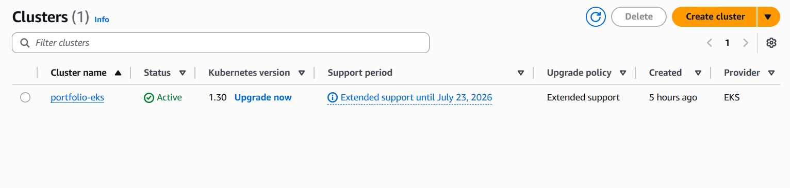
*AWS EKS Cluster infrastructure setup with managed Kubernetes control plane.*

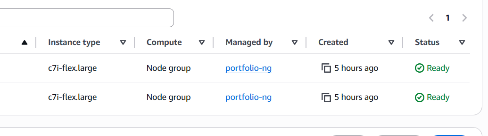
*EKS worker nodes running portfolio application workloads.*

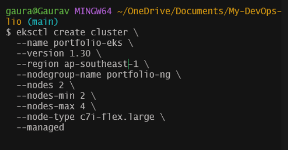
*Cluster resources (deployments, services, pods) management view.*

---

### ArgoCD / GitOps

The screenshots below show ArgoCD in action — application synchronization, resource health, and deployment tracking.

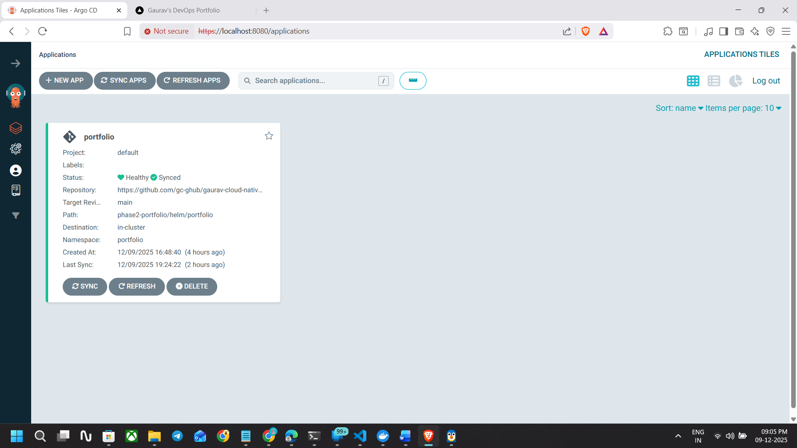
*ArgoCD Applications list showing sync status and health of portfolio deployment.*

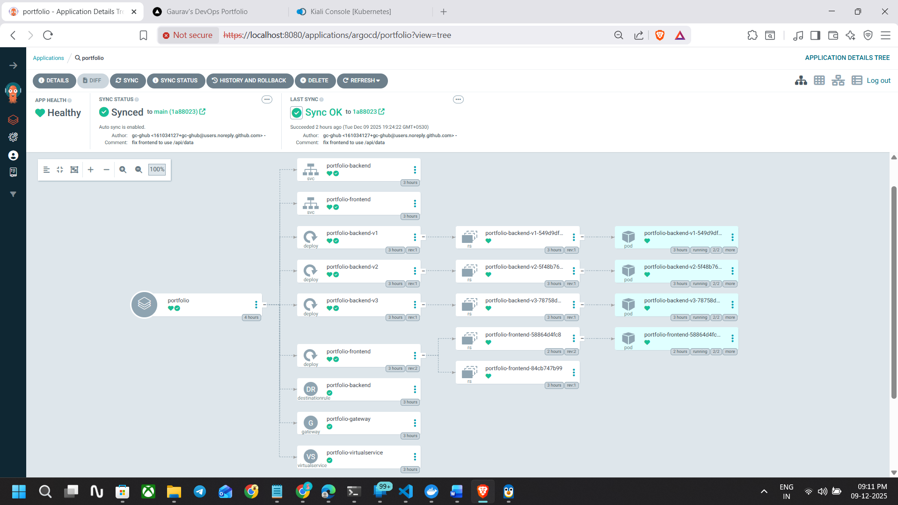
*ArgoCD sync operations, resource tree, and recent deployment history.*

---

### Backend Services (v1, v2, v3)

The portfolio showcases three versioned backend services with different endpoints and visual indicators.

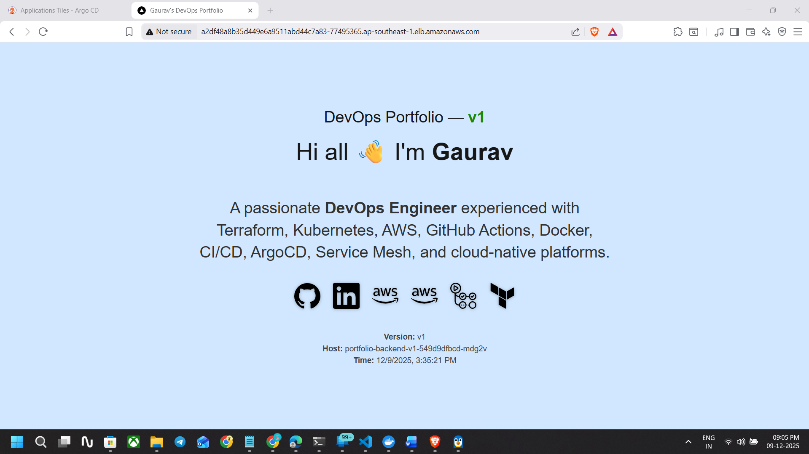
*Backend v1 service response (70% traffic weight) with version identifier and hostname.*

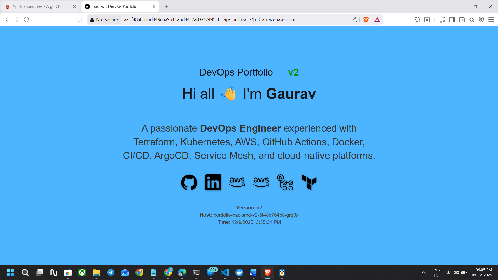
*Backend v2 service response (20% traffic weight) showing different output signature.*

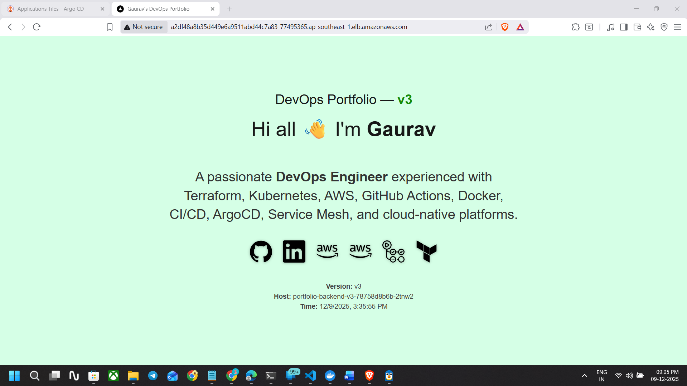
*Backend v3 service response (10% traffic weight) for canary testing and validation.*

---

### Istio / Kiali (Service Mesh Observability)

Kiali provides real-time visualization of the service mesh, traffic flows, and performance metrics.

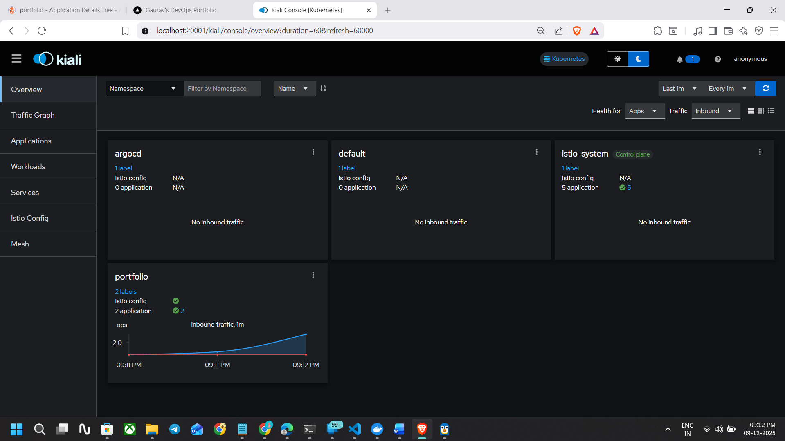
*Kiali mesh topology overview showing services, pods, and interconnections.*

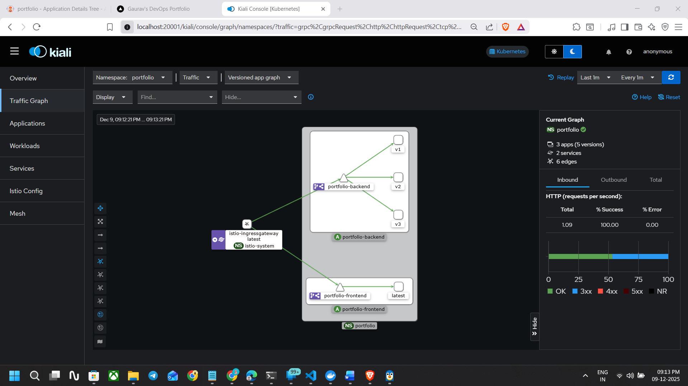
*Live traffic graph visualization between frontend and backend services.*

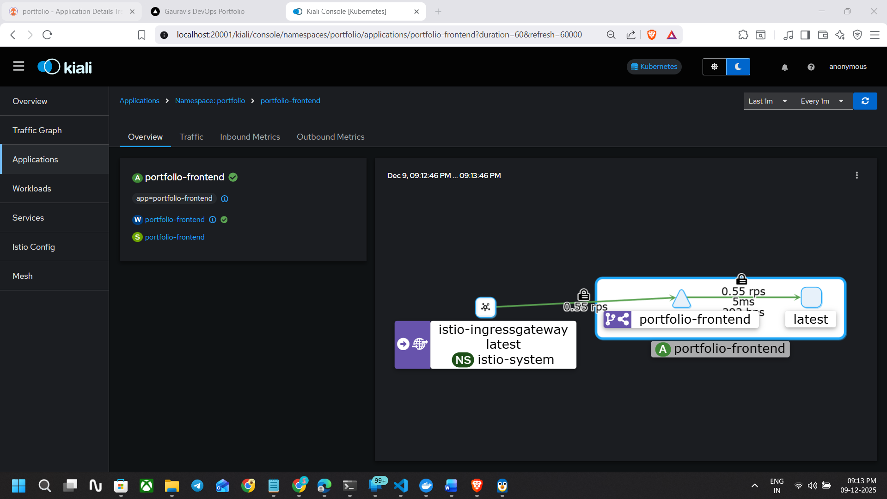
*Service-to-service communication patterns in real-time.*

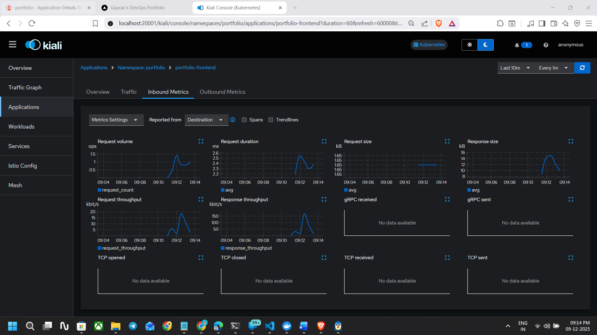
*Kiali workloads panel showing all deployed services (v1, v2, v3).*

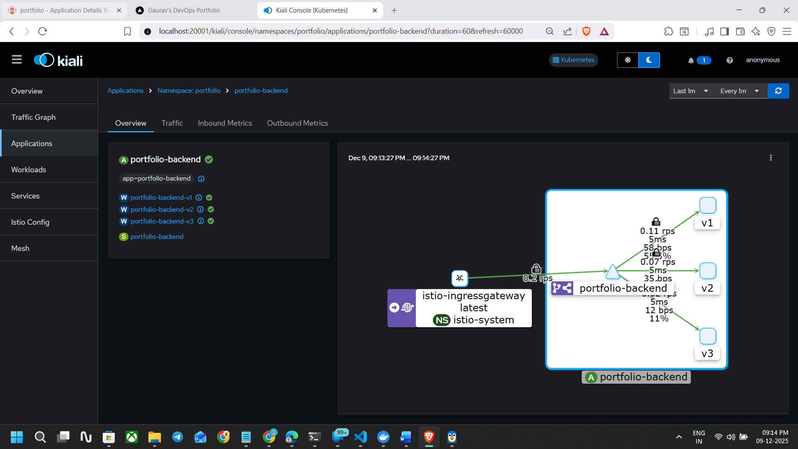
*Metrics dashboard displaying latency, error rates, and request volumes.*

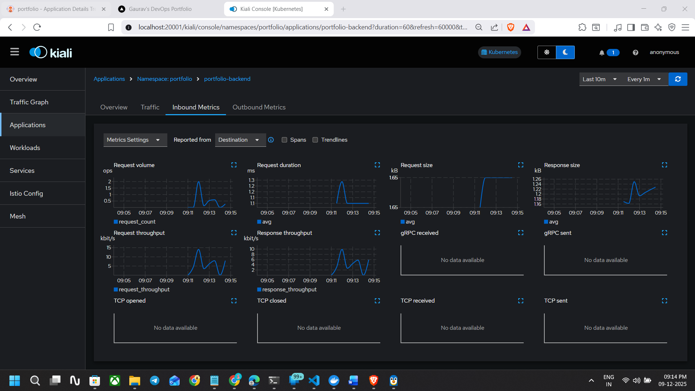
*Detailed service information including version distribution and health status.*

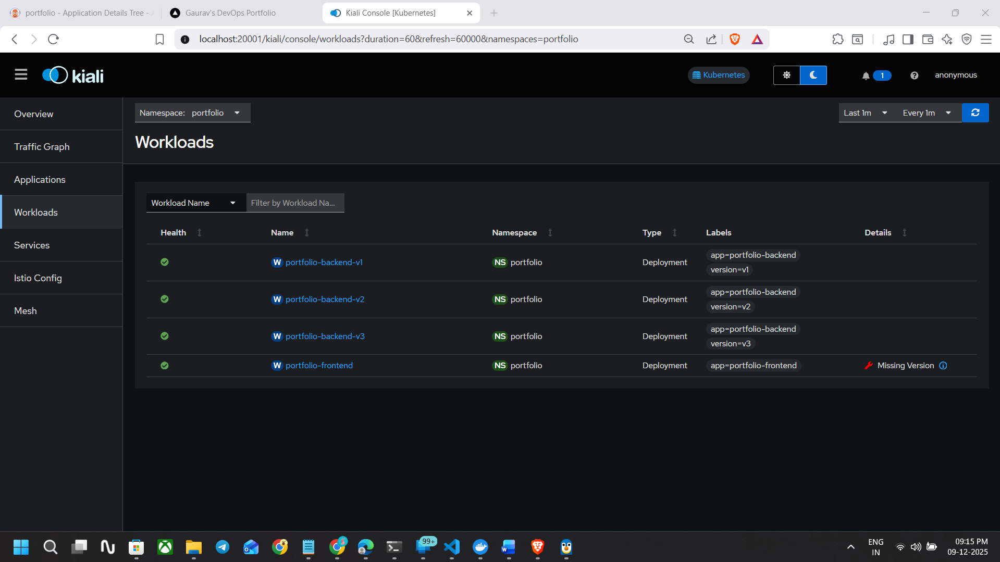
*Traffic splitting visualization showing weighted routing percentages.*

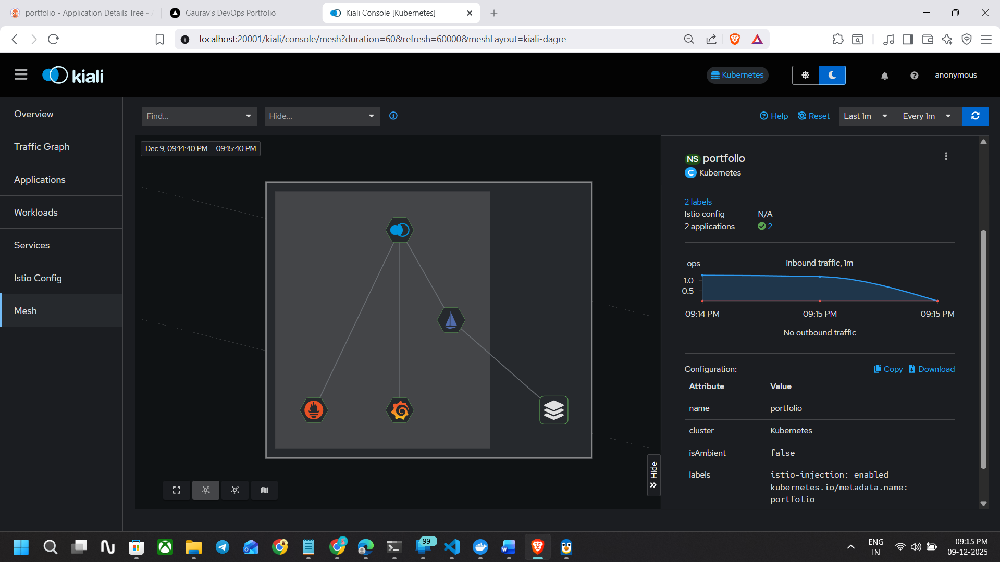
*Canary deployment scenario with traffic gradually shifting between versions.*

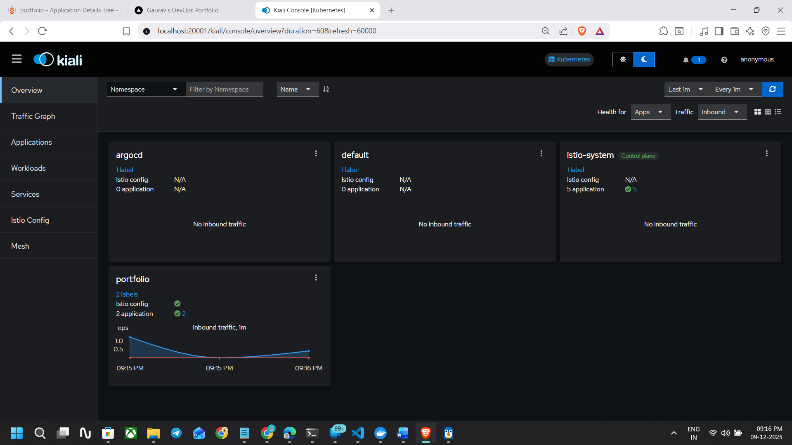
*Error tracking and analysis across service mesh.*

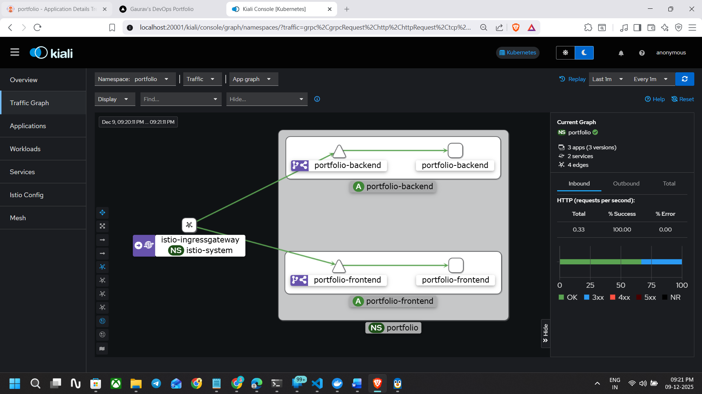
*Advanced metrics panel with p99 latency and throughput analysis.*

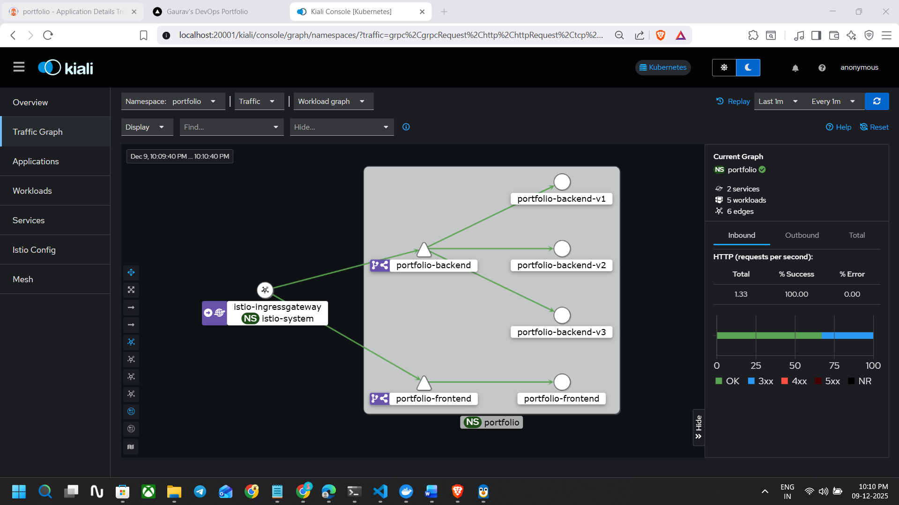
*Overall mesh health status and service connectivity insights.*

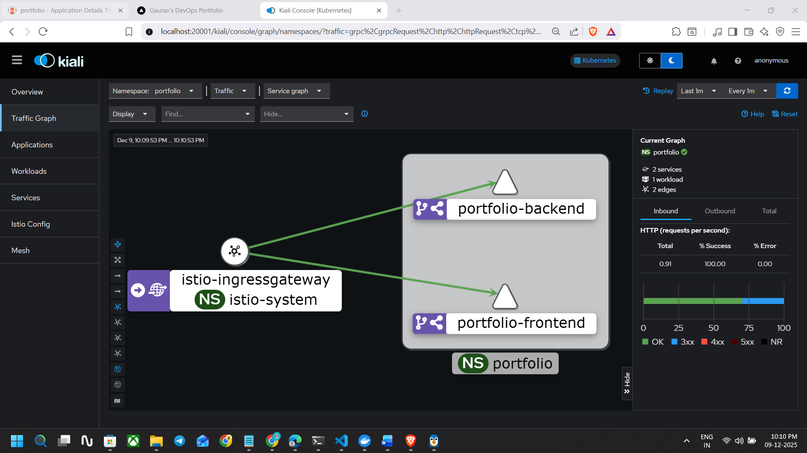
*Circuit breaker and destination rule configurations in action.*

---

### Canary Traffic Splitting Demos

The videos below demonstrate live canary deployments with traffic shifting between backend versions.

**Demo 1 (External User#1): Traffic Distribution (70/20/10)**

<video width="100%" controls>
  <source src="docs/Canary_Traffic_Splitting_demo-1.mp4" type="video/mp4">
  Your browser does not support the video tag.
</video>

*Canary_Traffic_Splitting_demo-1.mp4 — Shows initial weighted load distribution (v1: 70%, v2: 20%, v3: 10%) across backend services with real-time traffic visualization in Kiali.*

---

**Demo 2 (External User#2): Traffic Distribution (70/20/10)**

<video width="100%" controls>
  <source src="docs/Canary_Traffic_Splitting_demo-2.mp4" type="video/mp4">
  Your browser does not support the video tag.
</video>

*Canary_Traffic_Splitting_demo-2.mp4 — hows initial weighted load distribution (v1: 70%, v2: 20%, v3: 10%) across backend services with real-time traffic visualization in Kiali.*

---

## 📈 Next Steps & Enhancements

- [ ] Add MongoDB persistence layer
- [ ] Implement JWT authentication
- [ ] Add distributed tracing (Jaeger)
- [ ] Setup GitOps multi-environment support
- [ ] Add automated testing pipeline
- [ ] Implement service-to-service authentication
- [ ] Setup alerts and incident response
- [ ] Add cost optimization strategies

---

## 🤝 Contributing

Contributions are welcome! Please:

1. Fork the repository
2. Create a feature branch (`git checkout -b feature/amazing-feature`)
3. Commit changes (`git commit -m 'Add amazing feature'`)
4. Push to branch (`git push origin feature/amazing-feature`)
5. Open a Pull Request


---

## 📞 Contact & Support

- **Repository:** https://github.com/gc-ghub/gaurav-cloud-native-devops-portfolio
- **Author:** Gaurav Chaurasia
- **LinkedIn:** https://www.linkedin.com/in/gc-devops-world/


---

## 🙏 Acknowledgments

- Inspired by [Istio Bookinfo Application](https://istio.io/latest/docs/examples/bookinfo/)
- Built with [AWS EKS](https://aws.amazon.com/eks/)
- Service mesh powered by [Istio](https://istio.io/)
- GitOps by [ArgoCD](https://argoproj.github.io/cd/)
- Observability with [Prometheus](https://prometheus.io/), [Grafana](https://grafana.com/), and [Kiali](https://kiali.io/)

---

**Last Updated:** December 2025  
**Version:** 1.0.0